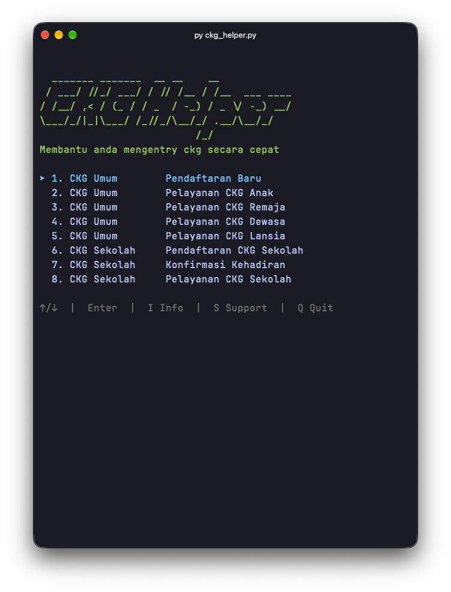

# CKG No Worry


<p>
  <strong>Otomasi untuk membantu proses entri data CKG (Cek Kesehatan Gratis).</strong>
</p>

<p>
  Aplikasi otomasi berbasis python dan playwright yang dapat membantu entri data Cek Kesehatan Gratis dengan lebih mudah dan cepat.
</p>

<p>
  
  
  
  
  
  
</p>


---
## ✅ Stable Release

Versi stabil adalah 1.1.0 yang dapat [diunduh di sini.](https://github.com/stywn93/ckg-helper/releases/download/v1.1.0/ckg-helper-v1.1.0-windows.zip)

---

## 🖥️ Preview

<p align="center">
  
</p>

> **Simplify knowledge work without losing structure.**

---

## ✨ Features

CKG Helper saat ini mampu menjalankan :

- CKG Umum - Pendaftaran Baru
- CKG Umum - Pelayanan Anak
- CKG Umum - Pelayanan Remaja
- CKG Umum - Pelayanan Dewasa
- CKG Umum - Pelayanan Lansia
- CKG Sekolah - Pendaftaran Baru
- CKG Sekolah - Konfirmasi Kehadiran
---

# 🏗️ Susunan Folder
Setelah mengunduh aplikasi, pastikan dataset diletakkan pada folder `dataset/`.


```text
CKG Helper
│
├── ckg-helper.exe
│
├── dataset/
│   ├── ckg_data.xlsx               

1 file berisi seluruh sheet

```